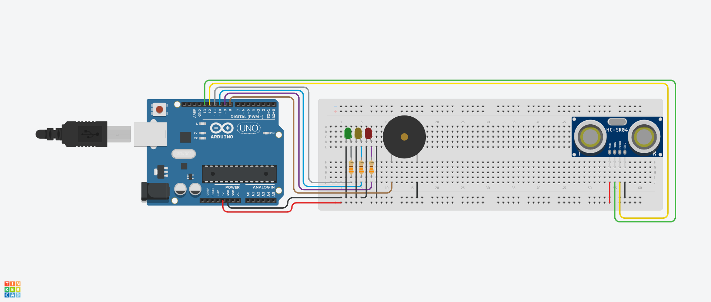

# Proximity Sensor - HC SR04

## Components

| Component                  | Quantity |
| -------------------------- | -------- |
| Arduino Uno R3             | 1        |
| Ultrasonic Distance Sensor | 1        |
| 330 Ω Resistor             | 3        |
| Green LED                  | 1        |
| Yellow LED                 | 1        |
| Red LED                    | 1        |
| Piezo                      | 1        |

## Circuit

